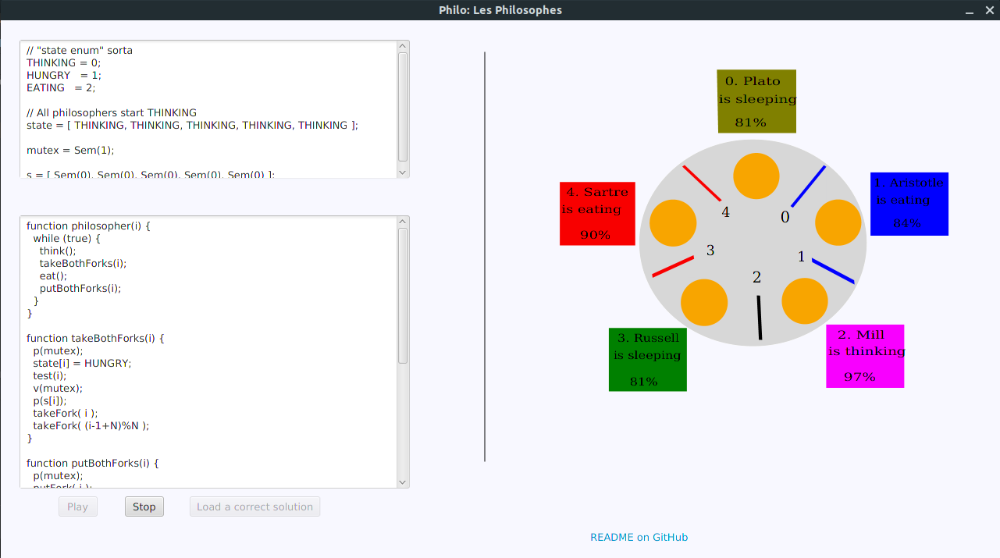
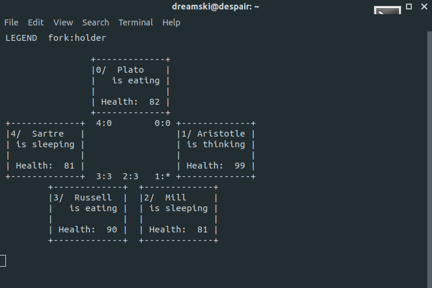
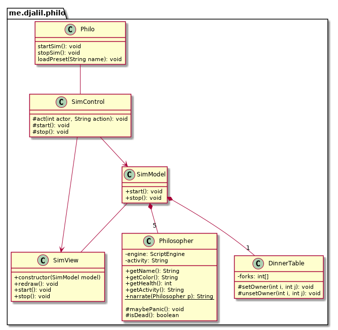

# PhiloFX: Dining Philosophers
Dinning philosophers problem visualization in Java _#JavaFX #JavaScriptingAPI #Nashorn_  
(This is a rough work-in-progress--see the [TODO file](./TODO).)

<p style="text-align: center;">
  
</p>

After [**Trois Threads**](https://djalil.me/trash/2019-11/dac-exo3/?scenario=p1,p2,p3) (useless vizualization) and [**Traffic Sim**](https://github.com/djalilhebal/softviz-semaphores) (web simulation), I think it's time for a more serious simulation in Java.





## How to use

Write the `philosopher(i)` (or `philosophe(i)`) procedure to solve the dining philosophers problem using semaphores.

From the command line (***on Linux!***):

```sh
java -jar philo.jar PRESET
```

* Presets:
  - **sol0**: Mutex, only one philo can eat at a time.
  - **sol1**: Sem for each fork, deadlocks are possible (_written in French_)
  - **sol2**: Sem for each philo, philosophers wake one another to eat
  - **sol3**: The last philo is left-handed
  - **sol4**: Only `N - 1` philos can attempt to acquire forks at any given time

_\* These are read from the `presets` folder in the current working directory._

### Predefined functions
- `N` is the total number of philosophers

- `think()` or `penser()`: Lasts for 5-10 seconds, refills philosopher's "health".

- `eat()` or `manger()`: Lasts for 5-10 seconds

- `takeFork(i)` or `prendreFourchette(i)`: **Actually** take the fork!

- `putFork(i)` or `poserFourchette(i)`: **Actually** put the fork down!

- `Sem(n)`: Same as `new Semaphore(n, true)`
- `p(sem)`: Same as `sem.acquire()`
- `v(sem)`: Same as `sem.release()`

## How it works
...

Nashorn to execute user code



### Java
- JavaScript's `setTimeout`/`setInterval` counterpart in Java: [Timer](https://docs.oracle.com/javase/8/docs/api/java/util/Timer.html) and [TimerTask](https://docs.oracle.com/javase/8/docs/api/java/util/TimerTask.html).

- Visualizing using SVG by updating it through the `Document` interface via JavaFX's [WebEngine](https://docs.oracle.com/javase/8/javafx/api/javafx/scene/web/WebEngine.html).

### Notes
- Alternative scripting engine: Mozilla's [Rheno](https://developer.mozilla.org/en-US/docs/Mozilla/Projects/Rhino/Documentation)

## References and Good Reads
- Oracle's <cite>Java Scripting Programmer's Guide</cite>
- Andrew S. Tanenbaum - <cite>Modern Operating Systems 4th ed.</cite>

## Credits and Thanks

- The "animation" is partially inspired by Simon Ingeson's <a href="https://github.com/smonn/hungrythinkers">Hungry Thinkers</a>.

- The logo is composed from
  * [Chopsticks by Peter Emil van den Berg, NL](https://thenounproject.com/search/?q=chopsticks&i=738575)
  * [Philosopher's stone by Locad, GB](https://thenounproject.com/search/?q=philosopher&i=1419650)


## License
By @djalilhebal and @wanisramdani, under CC BY 3.0
